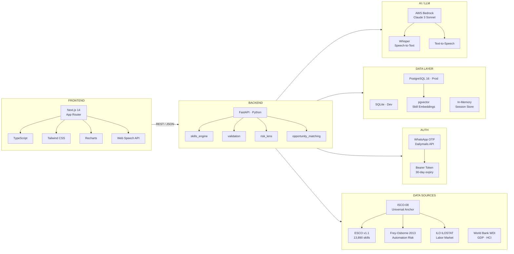

# Skills-Craft —UNMAPPED

> **Closing the distance between real skills and economic opportunity in the age of AI.**

Built for **Challenge 05 — UNMAPPED** · MIT Hackathon in collaboration with MIT Club of Northern California, MIT Club of Germany, and **The World Bank Youth Summit**.

---

## The Problem

Meet **Amara**. She is 22, lives outside Accra, and holds a secondary school certificate. She speaks three languages, has been running a phone repair business since she was 17, and taught herself basic coding from YouTube videos on a shared mobile connection.

By any reasonable measure, Amara has skills. But no employer in her city knows she exists. No training program has assessed what she already knows. No labor market system has a record of her.

**To the formal economy, Amara is unmapped. She is not the exception — she is the rule.**

Hundreds of millions of young people across low- and middle-income countries (LMICs) sit at a broken intersection: education systems that don't speak the language of labor markets, employers who can't find talent they can't credential-check, and an AI disruption redrawing the skills landscape faster than any institution can track.

### Three Structural Failures

| Failure | What It Means |
|---|---|
| **Broken Signals** | Education credentials don't translate into labor market signals. A secondary school certificate tells an employer almost nothing. Informal skills are invisible. |
| **AI Disruption Without Readiness** | Automation is arriving unevenly. Jobs in routine and manual work — disproportionately held by young LMIC workers — face the highest disruption risk. Youth have no tools to understand or navigate this. |
| **No Matching Infrastructure** | Even where skills and jobs exist in the same place, the connective tissue is absent. Matching happens through informal networks that systematically exclude the most vulnerable youth. |

---

## Our Solution

**Skills-Craft** is an open, localizable infrastructure layer — not just an app — that any government, NGO, training provider, or employer can plug into and configure with local data without rebuilding from scratch.

It implements all three required modules from the challenge spec:

### Module 1 — Skills Signal Engine
A conversational AI interview extracts skills from what a user actually says — their work history, informal experience, activities — and maps them to a **portable, standardized skill profile** grounded in the ESCO v1.1 taxonomy (13,890 skills) with ISCO-08 occupation codes as the universal anchor. The profile is human-readable: Amara can understand and own it.

### Module 2 — AI Readiness & Displacement Risk Lens
Given a skills profile and local labor market context, the tool produces an honest readiness assessment using **Frey-Osborne 2013 automation probability scores calibrated for LMICs** (automation risk in Kampala is not the same as in Kuala Lumpur). Skills are bucketed into AT RISK / EMERGING / DURABLE with country-specific calibration factors. Education projections from the **Wittgenstein Centre 2025–2035** show how the landscape is shifting, not just where it stands today. Users can compare their risk profile across any of 195 countries.

### Module 3 — Opportunity Matching & Econometric Dashboard
Real labor market signals — wage floors, sector employment growth, informal economy share, GDP per capita, Human Capital Index — sourced from **ILO ILOSTAT** and **World Bank WDI** are surfaced visibly to the user (not buried in the algorithm). Opportunities are matched to durable and emerging skills with honest, grounded matching that accounts for local realities. A separate policymaker dashboard shows aggregate signals.

---

## AI Validation Interview

Beyond passive profiling, Skills-Craft includes a live **voice-based AI validation interview** that verifies claimed skills through adaptive questioning:

- Conversational flow — each question builds on what the candidate actually said in their previous answer
- CISSP-CAT adaptive testing — fewer questions when outcome is clear, more depth when borderline
- Face tracking + behavioural integrity signals
- Speech-to-text via Whisper + Text-to-speech via AWS Bedrock
- Results in a portable **Skill Certificate** with confidence scores per skill

---

## Architecture



> Interactive version: [View in FigJam →](https://www.figma.com/board/hXB9lzb4hLV2cmg4RbKs7l)

---

## Tech Stack

| Layer | Technology | Why |
|---|---|---|
| Frontend | Next.js 14 + TypeScript | App Router, SSR, type-safe API contracts |
| Styling | Tailwind CSS | Utility-first; maps cleanly to custom design system |
| Charts | Recharts | RadarChart, BarChart, LineChart — one library |
| Backend | FastAPI (Python) | Async, Pydantic validation, auto OpenAPI docs |
| LLM | AWS Bedrock (Claude 3) | Managed, no GPU infra; handles unstructured skill extraction |
| Database | SQLite (dev) → PostgreSQL 16 (prod) | Zero-config dev; same schema migrates with one env var |
| Skill Search | pgvector | Semantic similarity without a separate vector DB |
| Skill Taxonomy | ESCO v1.1 | 13,890 skills, authoritative EU taxonomy, free bulk CSV |
| Occupation Codes | ISCO-08 | Universal anchor — works across all 195 countries |
| Automation Risk | Frey-Osborne 2013 | Only published dataset with probability per occupation |
| Labor Data | ILO ILOSTAT + World Bank WDI | Real employment and GDP signals, not assumptions |
| Auth | WhatsApp OTP (Dailymails API) | Target users have WhatsApp, not always email |

---

## Country-Agnostic by Design

The system is configurable per country without changing the codebase. Each country config (YAML) sets:

- Labor market data source and sector vocabulary
- Education level taxonomy and credential mapping
- Automation exposure calibration factor (LMIC vs. high-income context)
- Opportunity types surfaced (formal, informal, gig, training pathways)
- Local language context for the interview

Currently configured for: **Ghana · India · Nigeria · Kenya · Bangladesh** with a universal fallback covering all 195 countries via ISCO-08.

---

## Data Sources Used

| Source | Used For |
|---|---|
| ESCO v1.1 (European Commission) | Skill taxonomy — 13,890 skills, multilingual, portable |
| ISCO-08 (ILO) | Occupation codes — universal anchor for all country mapping |
| Frey & Osborne 2013 | Automation probability per occupation, LMIC-calibrated |
| ILO ILOSTAT | Wage data, employment by sector, informal economy % |
| World Bank WDI | GDP per capita, Human Capital Index, education indicators |
| Wittgenstein Centre | Education level projections 2025–2035 by country |

---

## Getting Started

### Prerequisites
- Python 3.11+
- Node.js 18+
- AWS account with Bedrock access (Claude 3 Sonnet)

### Backend
```bash
cd backend
cp .env.example .env        # fill in your keys
pip install -r requirements.txt
uvicorn main:app --reload --port 8001
```

### Frontend
```bash
cd frontend
cp .env.example .env.local  # set NEXT_PUBLIC_API_URL
npm install
npm run dev
```

Open [http://localhost:3000](http://localhost:3000).

---

## Why This Matters

> *Youth unemployment in low- and middle-income countries represents one of the defining structural failures of our time — with over 600 million young people holding real, unrecognised skills that broken credentialing systems and absent matching infrastructure render economically invisible. As AI accelerates occupational disruption faster than any institution can absorb, the countries and communities that build open skills infrastructure today will determine whether the coming decade becomes one of shared economic mobility — or one in which the most capable generation in history is also the most structurally excluded.*
>
> — Challenge 05 brief, MIT Hackathon · World Bank Youth Summit

---

## Team — Euphoria

| Name | Role |
|---|---|
| **Kanak Yadav** | Frontend — Next.js, UI/UX, design system |
| **Lakshay Singh** | Backend — FastAPI, skill engine, opportunity matching, risk lens |
| **Samnit Mehandiratta** | AI/ML, Auth, Data Models — LLM integration, validation interview, ESCO graph, WhatsApp OTP, database schema |
